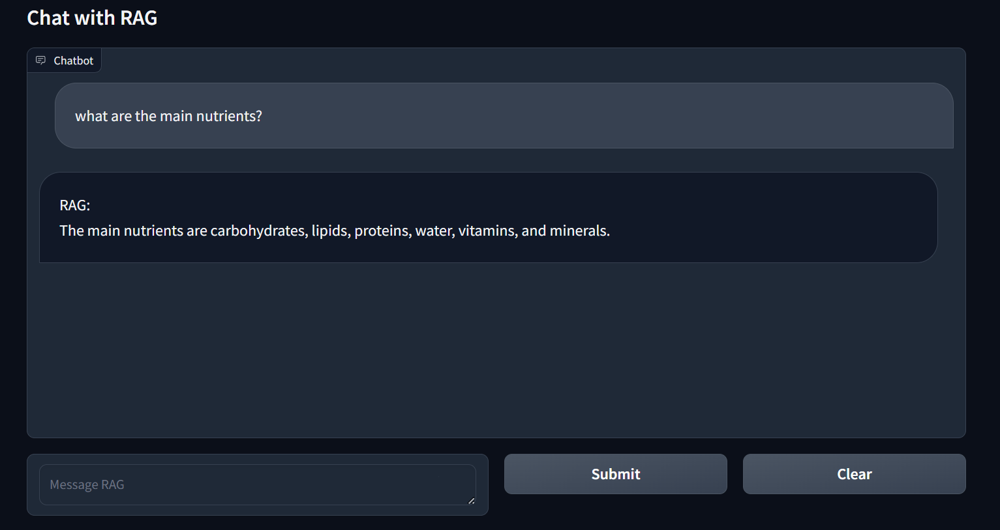

# RAG

## Overview

This project implements a Retrieval-Augmented Generation (RAG) system, an approach that combines the strengths of retrieval-based and generation-based methods to produce high-quality text generation. This implementation is inspired by the work done from [mrdbourke](https://www.youtube.com/watch?v=qN_2fnOPY-M).

## How RAG Works

### 1. Information Retrieval
The first step in the RAG process involves retrieving relevant information from a large corpus of documents. This step is crucial as it ensures that the LLM has access to factual and relevant information, improving the accuracy and relevance of the generated text.

For this task, we use **all-mpnet-base** as our retriever. The retriever takes an input query and searches through a document database to find the most relevant ones. 

### 2. Document Re-Ranking
Once the initial set of documents is retrieved, they are re-ranked to prioritize the most relevant documents. This re-ranking step improves the quality of the retrieved documents, ensuring that only the most useful information is presented to the generation model. This step helps to reduce the amount of documents used by the LLM.

For re-ranking, we use **mixedbread-rerank-large**. This model re-evaluates the relevance of the retrieved documents to the query and re-orders them accordingly.

### 3. Text Generation
The final step involves generating the output text based on the retrieved and re-ranked documents. The generation model uses the context provided by these documents to produce coherent and contextually accurate responses.

For the text generation, we use **Gemma 2b** as our LLM. This model leverages the information from the retrieved documents to generate high-quality, contextually appropriate text.

## Default Configuration
- **LLM**: Gemma-1.1-2b-it
- **Reranker**: mxbai-rerank-large-v1
- **Retriever**: all-mpnet-base-v2

## Suggested Configuration
- **LLM**: LLama v2 or greater
- **Reranker**: mxbai-rerank-large-v1
- **Retriever**: all-mpnet-base-v2


By default, this setup ensures a robust RAG system capable of producing high-quality text generation by effectively combining the retrieval, re-ranking, and generation processes.

## Getting Started

To get started with this project, follow the instructions below:

1. Clone the repository:
   ```bash
   git clone https://github.com/MarcoChain/RAG.git
   ```

2. Install the necessary dependencies:
   ```bash
   pip install -r requirements.txt
   ```

3. Run the main script:
   ```bash
   python main.py
   ```

## Gradio

An interface created using gradio is available!



Run gradio interface:
   ```bash
   python gradio_app.py
   ```

## Conclusion

Feel free to customize this further to better fit your specific project details and requirements!